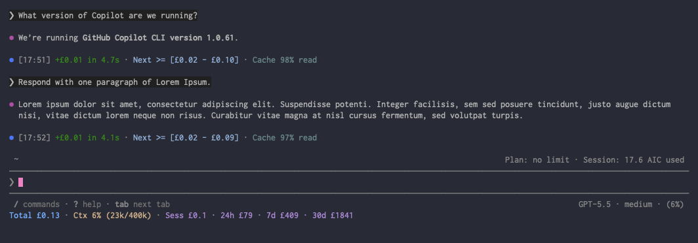
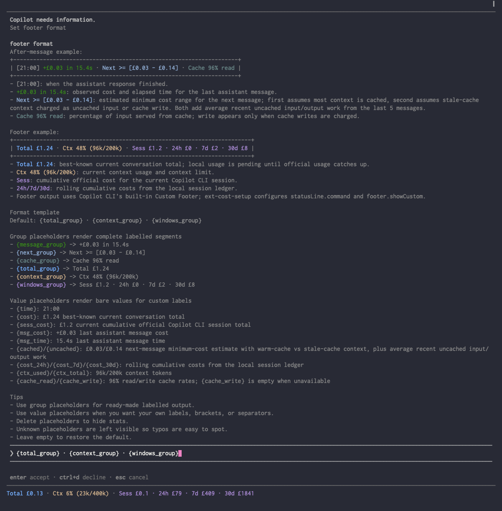

# Copilot extensions

A small collection of GitHub Copilot CLI extensions that make day-to-day agent work more visible, controllable, and useful.

This repo currently contains one plugin, but it is structured as a Copilot CLI marketplace: each installable plugin lives under `plugins/<name>/` and can bundle a native extension where needed.

## Plugins

### copilot-cost

[`copilot-cost`](plugins/copilot-cost) shows Copilot CLI message cost, conversation cost, cumulative Copilot session total, context usage, cache health, and rolling 24h/7d/30d usage while you work.

It gives you a lightweight answer to: "What did that response cost?", "How much has this conversation used?", "How much has this Copilot session used?", "How full is my context?", and "Is caching helping?"

It has no npm runtime or development dependencies; Copilot CLI provides the extension runtime package. That keeps the installed supply-chain surface small.



#### Install

Make sure Copilot CLI is up to date:

```sh
copilot update
```

Make sure Node.js 18 or newer is installed and available as `node`. The setup script and `statusLine.command` both call `node` directly.

Add this repository as a plugin marketplace, then install `copilot-cost`:

```sh
copilot plugin marketplace add RogueKernel/copilot-extensions
copilot plugin install copilot-cost@copilot-extensions
```

Open Copilot CLI with experimental extension support enabled:

```sh
copilot --experimental
```

`copilot --experimental` opens an interactive Copilot session and stays open, so do not chain another install command after it with `&&`. If you are already inside Copilot, make sure experimental mode is on with `/experimental on`.

Then set up the bundled native extension by running:

```text
/copilot-cost:ext-cost-setup
```

Or use the all-in-one command:

```sh
copilot --experimental -i "/copilot-cost:ext-cost-setup"
```

Setup installs a managed native-extension shim at `~/.copilot/extensions/copilot-cost/extension.mjs`, configures `statusLine.command` to call the installed plugin directly with `node`, and enables `footer.showCustom`.

Restart Copilot CLI, start a new session, or run `/clear`, then run `/cost` to configure or confirm it loaded.

Copilot CLI also discovers native extensions from:

- `.github/extensions/<extension-name>/extension.mjs` in a project
- `~/.copilot/extensions/<extension-name>/extension.mjs` for user-wide installs

#### Update

```sh
copilot plugin update copilot-cost
```

For local, unpushed changes, reinstall from the local marketplace instead:

```sh
copilot plugin install copilot-cost@copilot-extensions
```

#### Uninstall

Open `/cost`, choose **Settings**, then choose **Uninstall**. That removes the managed native-extension shim and restores any prior statusline/footer settings.

Afterward, remove the plugin package if you no longer want it installed:

```sh
copilot plugin uninstall copilot-cost
```

If you added this repository only for `copilot-cost`, you can also remove the marketplace:

```sh
copilot plugin marketplace remove copilot-extensions
```

#### Test locally before pushing

From any terminal, register this local checkout as a marketplace and install from it:

```sh
REPO="/path/to/copilot-extensions"
copilot plugin marketplace remove copilot-extensions 2>/dev/null || true
copilot plugin marketplace add "$REPO"
copilot plugin install copilot-cost@copilot-extensions
copilot --experimental
```

Inside Copilot CLI, run `/copilot-cost:ext-cost-setup`, then run `/clear` or start a new session and use `/cost`. To test without touching your real Copilot config, set isolated homes before the marketplace commands:

```sh
export COPILOT_HOME="$(mktemp -d)"
export COPILOT_CACHE_HOME="$COPILOT_HOME/cache"
```

#### After-message output

After each assistant response:

```text
[21:00] +£0.03 in 15.4s · Next >= [£0.03 - £0.14] · Cache 96% read
```

| Example | Name | Description |
| --- | --- | --- |
| `[21:00]` | Finish time | When the assistant response finished. |
| `+£0.03 in 15.4s` | Last message | Observed cost and elapsed time for the last assistant message. |
| `Next >= [£0.03 - £0.14]` | Next message est. | Estimated minimum cost range for the next message. The first value is the best case: most context is still cached. The second is the stale-cache case: context is charged as uncached input or cache write, depending on model pricing. Both add average recent uncached input/output work from the last 5 messages. |
| `Cache 96% read` | Cache read rate | Percentage of input served from cache. Cache write rate is also shown when cache writes are charged. |

#### Footer/statusline output

```text
Total £1.24 · Ctx 48% (96k/200k) · Sess £1.4 · 24h £0 · 7d £2 · 30d £8
```

| Example | Name | Description |
| --- | --- | --- |
| `Total £1.24` | Conversation cost | Best-known current conversation total: local assistant/compaction usage stays pending until Copilot's official statusline counter catches up. |
| `Ctx 48% (96k/200k)` | Context usage | Current context-window usage, shown as a percentage and as used/available tokens. |
| `Sess £1.4` | Copilot session total | Copilot's cumulative official running cost for the current Copilot CLI session. |
| `24h £0` | 24h local CLI cost | Session-ledger cost in the last 24 hours. |
| `7d £2` | 7d local CLI cost | Session-ledger cost in the last 7 days. |
| `30d £8` | 30d local CLI cost | Session-ledger cost in the last 30 days. |

`Sess` is the cumulative live official Copilot CLI session counter, shown in the same cumulative totals group as the 24h/7d/30d values. The same counter reconciles locally pending `Total` and keeps the current session ledger up to date because local events can miss tool and sub-agent work, but Copilot CLI sessions are terminal instances rather than conversation or account boundaries. Rolling 24h/7d/30d totals come from local Copilot CLI session telemetry, so they are not account-wide Copilot billing totals. For telemetry before June 1, 2026, old pay-per-message totals are ignored and retained token telemetry is valued as a historical equivalent under the current usage-based model when a post-June rate profile is available.

#### Configure

Use `/cost` interactively for a cost overview with local history, 24h/7d/30d/60d/90d/180d cumulative totals, cost by calendar month for the current and previous four months, a six-month month-block calendar with blank pre-data days and dash-filled no-spend days after local data begins, usage-based billing cost since June 1, 2026, historical equivalent estimates for earlier retained telemetry, and run-rate analysis based on the available local data coverage. Choose **Info** for metric/source details or **Settings** to configure what the extension shows, where it appears, which unit to use, and how summaries are formatted.


The Settings view includes display, unit, and format controls:



Direct commands are also available:

```text
/cost both
/cost footer
/cost message
/cost off
/cost gbp
/cost usd
/cost credits
```

The setup skill configures Copilot CLI's built-in Custom Footer through `statusLine.command` and enables `footer.showCustom`. If another statusline command already exists, setup replaces it with `copilot-cost` and saves the previous value so `/cost` > **Settings** > **Uninstall** can restore it.

#### More documentation

| Document | Purpose |
| --- | --- |
| [`Usage`](docs/copilot-cost/usage.md) | Install, configure, and customize output formats. |
| [`Architecture`](docs/copilot-cost/architecture.md) | Runtime architecture, persistence, and extension-system notes. |
| [`Development`](docs/copilot-cost/development.md) | Local commands, tests, and contributor conventions. |

## Repository structure

This repository is a Copilot CLI plugin marketplace. The marketplace manifest lives at `.github/plugin/marketplace.json`; plugin packages live under `plugins/`; `copilot-cost` bundles its native extension under `plugins/copilot-cost/extensions/copilot-cost/`.

## Development

Common commands from the repository root:

```sh
cd plugins/copilot-cost/extensions/copilot-cost
npm test
npm run check
npm run smoke:statusline
npm run validate
```

See each plugin's README for usage, architecture notes, and test commands.
