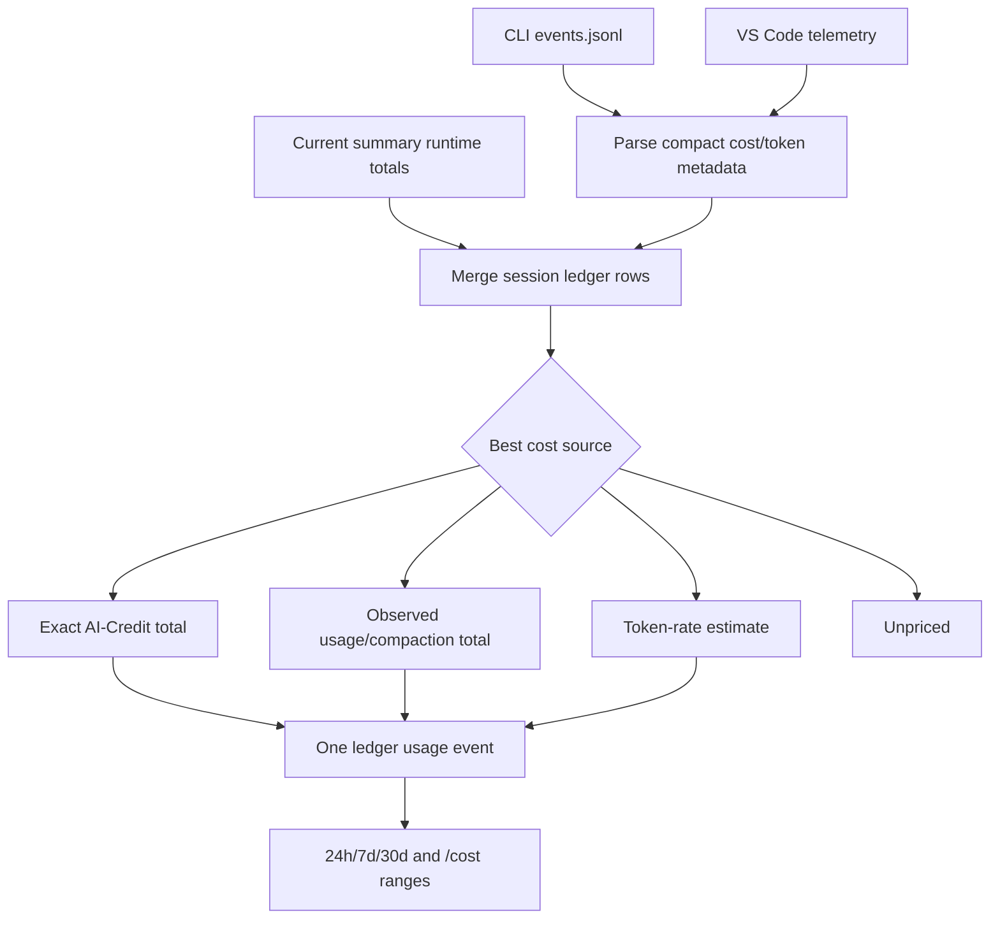

# Historical cost

Historical cost powers the `/cost` overview and the cached 24h/7d/30d footer windows. It is calculated from `session-ledger.v<plugin-version>.json`, not from a live account API.



## Ledger source priority

Each retained session has one cost source. Stronger sources replace weaker ones:

```text
none < estimated_tokens < usage_events/compaction < runtime/statusline < modelMetrics < shutdown
```

`shutdown` always wins, even if it is lower than a live/runtime value. That avoids double-counting when the final Copilot shutdown total corrects earlier partial observations.

| Data shape found | Ledger source | Calculation |
| --- | --- | --- |
| `session.shutdown.data.totalNanoAiu` | `shutdown` | Exact total. |
| Shutdown `modelMetrics.*.totalNanoAiu` only | `modelMetrics` | Sum model totals. |
| `assistant.usage` and/or compaction AIU, no shutdown | `usage_events` / `compaction` | Sum observed partial AIU. |
| Current open-session official total in summary state | `runtime` | Use current official session total until shutdown arrives. |
| Token totals plus trustworthy model rates | `estimated_tokens` | Estimate per model and token class. |
| Token totals with no trustworthy rate | `none` | Keep metadata, do not price. |

## Exact shutdown totals

Best case: a JSONL `session.shutdown` record contains `totalNanoAiu`.

```text
historicalUsd = totalNanoAiu / 1_000_000_000 * 0.01
```

This becomes a `closed` ledger row with source `shutdown`. Its timestamp bucket is `windowAt`, then `closedAt`, then `lastSeenAt`, then `lastUpdatedAt`.

## Shutdown model-metrics fallback

If shutdown has no top-level `totalNanoAiu`, the parser sums `modelMetrics.*.totalNanoAiu`.

```text
modelNanoAiu = sum(modelMetrics[model].totalNanoAiu)
historicalUsd = usd(modelNanoAiu)
```

This is still treated as closed history, but its source is `modelMetrics`, so a later full shutdown total can replace it.

## Open-session observed totals

Recent sessions without shutdown stay `open`. They can still contribute historical cost when local telemetry has real AIU:

- `assistant.usage` totals become `usage_events`, including rows that also have compaction AIU.
- Pure `session.compaction_complete` totals become `compaction`.
- current summary runtime official totals become `runtime` during full sync.

For `usage_events` plus `compaction`, the stored total is the sum of the observed AIU fields. For `runtime`, full sync folds the current official open-session total from summary state into the ledger so concurrent still-open sessions can appear in rolling totals before shutdown.

## Stale open sessions

Open sessions older than 7 days are auto-closed for reporting. The auto-close path tries, in order:

1. Add a token estimate for any unpriced remainder when the row has partial observed AIU.
2. Preserve any current post-pricing total already stored on the row.
3. Estimate the full session from retained token totals.
4. Leave the session unpriced if no trustworthy rate exists.

Estimated rows use source `estimated_tokens` and low confidence diagnostics.

## Token estimates

Token estimates are per model and per token class. The ledger first builds local rate profiles from post-pricing sessions whose model metrics isolate exactly one token class:

```text
nanoPerToken = observedNanoAiu / observedTokens
```

Authoritative shutdown/model-metrics profiles beat usage-event profiles. If no local profile exists for the model/class, `model-pricing.mjs` uses the built-in GitHub pricing fallback.

Input tokens are treated as total input, so billable uncached input is:

```text
billableInput = max(0, inputTokens - cacheReadTokens - cacheWriteTokens)
```

Then:

```text
estimatedNanoAiu =
  billableInput * inputRate
  + cacheReadTokens * cacheReadRate
  + cacheWriteTokens * cacheWriteRate
  + outputTokens * outputRate
  + reasoningTokens * reasoningRate
```

Unknown models or token classes stay unpriced. The code does not use a blended global rate.

## Pre-usage-based history

Usage-based billing starts at `2026-06-01`. For earlier sessions, stored pay-per-message totals are not treated as usage-based cost. Pre-cutover sessions can only contribute historical equivalent cost when retained token totals can be priced through local post-cutover rates or the built-in pricing fallback.

## Window calculation

`ledgerUsageEvents()` emits at most one usage event per retained session:

```text
{ at: bucketTimestamp(session), usd: calculatedSessionUsd, id: session.id }
```

Events outside the 180-day retention horizon are ignored. The footer windows sum those events since `now - 24h`, `now - 7d`, and `now - 30d`; `/cost` uses the same ledger events for its longer retained-history views.
