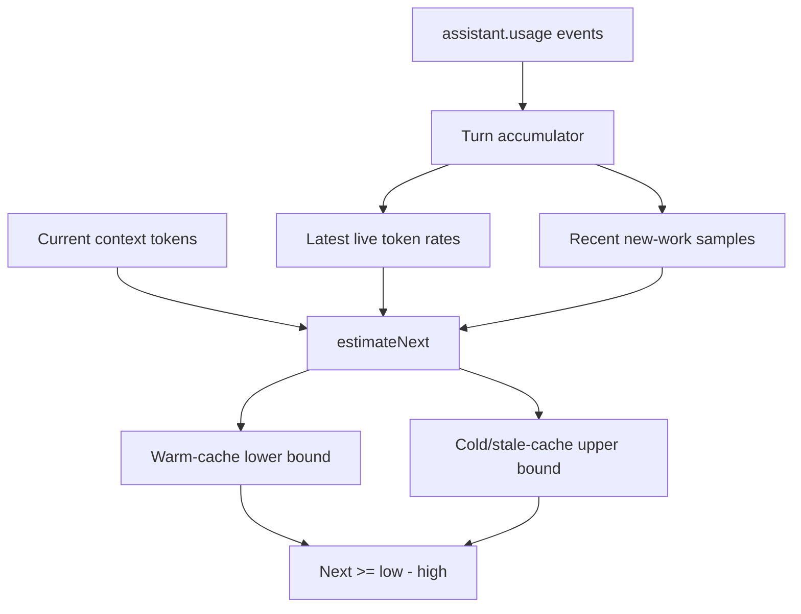

# Next message cost estimate

The after-message `Next >= [low - high]` value is produced by `estimateNext()` in `src/domain/cost.mjs`. It is a minimum-cost range for the next response, not a forecast of exact spend.



## Inputs

- `contextTokens`: the current context-window token count from `session.usage_info`.
- `inputNanoPerToken`, `cacheReadNanoPerToken`, `cacheWriteNanoPerToken`, `outputNanoPerToken`: live rates measured from `copilotUsage.tokenDetails`.
- `newWorkSamples`: up to the last 5 completed turns, each storing uncached input tokens, priced cache-write tokens, and output tokens.

Rates are measured in nano-AIU per token. `rates.mjs` classifies provider token-detail rows by token type and keeps the highest finite matching rate for each class. Cache-write rates are used only when the provider reports priced cache-write token details.

## Bounds

The implementation starts by choosing the rates:

```js
const lowerRate = cachedRate !== undefined && inputRate !== undefined ? blend(cachedRate, inputRate) : inputRate;
const upperRate = optNum(cost.cacheWriteNanoPerToken) ?? inputRate;
```

The lower bound assumes most existing context will be read from cache:

```text
lowerRate = cacheReadRate * 0.95 + inputRate * 0.05
lowerUsd = usd(contextTokens * lowerRate) + averageNewWorkUsd
```

If no cache-read rate is known, the lower bound falls back to the normal input rate.

The upper bound assumes the existing context is stale or cold:

```text
upperRate = cacheWriteRate ?? inputRate
upperUsd = usd(contextTokens * upperRate) + averageNewWorkUsd
```

This uses cache-write pricing when available because some models charge stale context as cache creation. Otherwise it uses normal uncached input pricing.

## New work sample

Each completed turn stores:

```text
uncachedInputTokens = max(0, inputTokens - cacheReadTokens - cacheWriteTokens)
cacheWriteTokens = pricedCacheWriteTokens
outputTokens = outputTokens
```

`averageNewWorkUsd` prices the average of the retained samples using the latest input, cache-write, and output rates:

```text
averageNewWorkUsd =
  usd(avgUncachedInputTokens * inputRate)
  + usd(avgCacheWriteTokens * cacheWriteRate)
  + usd(avgOutputTokens * outputRate)
```

An empty sample history contributes zero. Missing cache-write or output rates contribute zero for that class. This keeps the estimate mostly about the current context cost, while still accounting for the typical amount of new prompt/cache-write/output work added by recent turns.

## Worked example

Given:

```text
contextTokens = 1,000
inputRate = 1,000 nano-AIU/token
cacheReadRate = 100 nano-AIU/token
cacheWriteRate = 1,250 nano-AIU/token
outputRate = 2,000 nano-AIU/token
recent sample = 10 uncached input tokens, 5 output tokens
```

The warm-cache lower rate is blended:

```text
(100 * 0.95) + (1,000 * 0.05) = 145 nano-AIU/token
```

The new-work add-on is:

```text
(10 * 1,000) + (5 * 2,000) = 20,000 nano-AIU
```

So the range is:

```text
lower = usd(1,000 * 145 + 20,000) = $0.00000165
upper = usd(1,000 * 1,250 + 20,000) = $0.00001270
```

This mirrors the unit test in `test/unit/cost.test.mjs`; display formatting later rounds those values for GBP/USD/AI Credits output.

## Failure mode

`estimateNext()` returns no estimate until it has:

- context token count
- input rate

Missing cache-read, cache-write, or output rates do not disable the estimate. Cache-read falls back to the input rate for the lower bound, cache-write falls back to the input rate for the upper bound, and missing output rate makes the sampled output-work add-on zero.

Rendering falls back to a zero range in the selected unit when no estimate is available, so missing host telemetry does not break the footer or after-message output.
