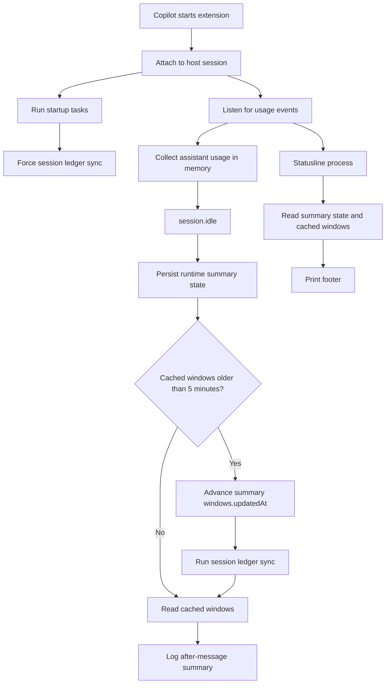
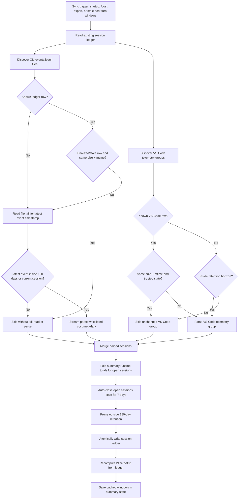
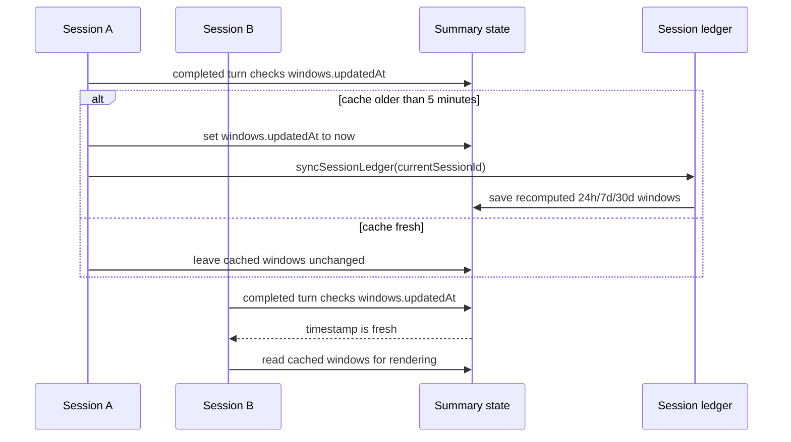

# copilot-cost architecture

`copilot-cost` is a Copilot CLI extension that shows message cost, context usage, cache health, a cumulative Copilot CLI session total, and rolling cost windows after assistant messages and in the statusline footer.

## Source layout

The bundled native extension entrypoint is `plugins/copilot-cost/extensions/copilot-cost/extension.mjs`. Copilot CLI 1.0.62 and newer loads it directly from the installed plugin. The entrypoint only chooses the runtime:

| Runtime | Launch path | Responsibility |
| --- | --- | --- |
| Extension runtime | Imported by the Copilot extension bootstrap | Listens to usage events, updates summary display state, and syncs historical ledger data. |
| Statusline runtime | `node extension.mjs --statusline` | Reads one JSON status payload from stdin, loads summary state, and prints footer text without persisting data. |

Copilot CLI discovers project extensions from immediate subdirectories under `.github/extensions/`, user extensions under `~/.copilot/extensions/`, and plugin-shipped extensions under installed plugin `extensions/<name>/extension.mjs` directories.

Implementation lives under `plugins/copilot-cost/extensions/copilot-cost/src/`:

| Path | Role |
| --- | --- |
| `runtime/` | Host event wiring and process entrypoints. |
| `domain/` | Accounting, session-ledger sync, JSONL metadata parsing, redacted session export, estimates, rate extraction, rolling windows, snapshots, context readers, and turn accumulation. |
| `render/` | Terminal output formatting. |
| `settings.mjs` | Global display settings, parsers, and the `/cost` command flow. |
| `state.mjs`, `summary-state.mjs` | Persisted hot-path runtime state, cached windows, and statusline workspace discovery. |
| `io.mjs`, `math.mjs`, `config.mjs` | Shared foundations for persistence, numeric coercion, constants, and display tokens. |

## Runtime flow

1. `extension.mjs` checks for `--statusline`.
2. Normal extension sessions call `runExtension()`, import `@github/copilot-sdk/extension` inside that function, join the session, register `/cost`, and attach event handlers.
3. On attach, the runtime starts a best-effort session-ledger sync for the current Copilot CLI session id. It discovers recent `~/.copilot/session-state/*/events.jsonl` files and supported local VS Code-family Copilot telemetry, parses only whitelisted cost/token metadata for new or changed session files, folds current summary runtime totals for open sessions into the ledger, tags records with a `surface`, auto-closes stale open sessions, prunes records outside the retention horizon, refreshes cached rolling windows in `summary-state.v<plugin-version>.json`, and removes summary records for sessions now closed in the ledger.
4. Assistant usage events accumulate into the current turn. On `session.idle`, the runtime snapshots the turn, merges it into plugin-data summary state, claims a rolling-window sync when the cached summary timestamp is more than five minutes old, and logs the after-message summary when enabled.
5. Successful `session.compaction_complete` events add compaction usage because they arrive outside the normal turn lifecycle and use the same stale rolling-window sync check.
6. Statusline invocations call `printStatusline()`, read stdin only to identify the session workspace, load runtime state and cached windows from `summary-state.v<plugin-version>.json`, and print the footer when enabled. Statusline refreshes do not write live totals or context back to plugin data.

The `/cost` Settings flow can also run a diagnostic export. **Export Session Data** discovers the same local `~/.copilot/session-state/*/events.jsonl` files, reads the current versioned session ledger, and writes `COPILOT_COST_DEBUG.jsonl` in the current working directory. Each JSONL row represents one discovered session or ledger row and keeps event-file metadata when available, event/type counts, extracted token/cost/model summaries, and the matching ledger row when present. It does not export prompts, assistant responses, transcript text, tool arguments, source code, or absolute local paths; event-file paths are normalized to session-state labels.

Sub-agent lifecycle events carry an `agentId`; the runtime ignores those for main-session turn timing and context updates so sub-agent work does not distort the active user's turn.

Footer output uses Copilot CLI's built-in Custom Footer. On first run, the native extension configures `statusLine.command`, enables `footer.showCustom`, and points the command at the plugin-bundled extension directly with `node`. The command is run by Copilot as a normal configured executable, not as a native extension subprocess, so Node.js 18+ must be installed and available as `node`. If another statusline command already exists, `copilot-cost` replaces it and saves the previous value for `/cost` > **Settings** > **Uninstall** restoration. The footer command is a read-only renderer: `Total` is the reconciled best-known conversation total already stored by the native extension, and the cumulative totals group shows `Sess`, Copilot's raw official CLI session aggregate, alongside ledger-derived rolling 24h/7d/30d totals.

## Accounting boundaries

In Copilot CLI extension internals, a host `session` is the running Copilot instance in one terminal. It starts when `copilot` is opened and ends when that terminal instance exits. `copilot-cost` scopes persisted runtime state by the active workspace/session path, but it does not treat that Copilot CLI session as a conversation or account accounting boundary.

`session.rpc.usage.getMetrics()`, JSONL shutdown records, and statusline `ai_used.total_nano_aiu` values are Copilot CLI session aggregates. These sessions are terminal instances, not durable conversations or account boundaries. `copilot-cost` uses `session.rpc.usage.getMetrics()` in the native extension runtime when available; the standalone footer runtime does not capture or persist usage. The native extension updates summary runtime state: local assistant/compaction costs remain pending while the official counter lags, then positive official catch-up updates `Total`, clears caught-up pending cost, and updates the cumulative `Sess` total. Full ledger sync later rebuilds durable history from local session logs, refreshes cached windows, and prunes runtime entries whose stored `sessionId` is closed in the ledger.

Copilot CLI's built-in `/usage` command displays broader account/activity information, including last-180-days activity, total messages, changes, AI Credits, and token totals with cached and reasoning-token breakdowns. That is the desired class of source for account-level cumulative metrics, but no native-extension RPC/API for reading `/usage` output has been verified yet. The `account.getQuota` RPC and the underlying internal account endpoint can return billing-period quota snapshots, but not 24h/7d/30d historical spend, and direct external probes may trigger OS keychain prompts.

## Cost model

Current-turn and next-response estimates are derived from live `copilotUsage.tokenDetails` rates whenever Copilot provides them. Token-detail names vary by provider, so `domain/rates.mjs` classifies input, output, cache-read, and priced cache-write rows behind small predicates.

Conversation totals use an official-vs-pending model. Observed assistant-message usage and successful compactions are recorded as pending local cost because those events can miss tool and sub-agent work. `session.rpc.usage.getMetrics().totalNanoAiu` is the official active-session counter that the native extension uses to reconcile pending cost into `Total` and update summary state for live display. The `officialStartedUsd` turn-start guard prevents usage that becomes official mid-turn from being counted twice.

Next-response estimates use the current context size and live rates. The lower bound assumes warm-cache input blended by the expected cache-hit ratio; the upper bound uses cold-cache/cache-write pricing when available. Recent uncached input/output work samples are included so the estimate is not only the existing context cost.

GitHub Copilot usage-based billing converts model-specific token prices into AI credits, with 1 AI credit equal to $0.01 USD. Copilot's telemetry still uses `aiu` / AIU naming in places; in this domain model AIU is treated as the legacy/internal name for the same unit as AI Credits, not a separate currency. The built-in historical fallback rates in `domain/model-pricing.mjs` mirror GitHub's published model pricing table at <https://docs.github.com/en/copilot/reference/copilot-billing/models-and-pricing>. They are used only for token-only history when no authoritative AIU total or local observed rate can price that model/token class.

Historical token-only conversion is per model and per token class. GitHub's published prices are USD per 1 million tokens, so the equivalent formula is `usd = sum(tokenCountForClass * usdPerMillionForModelAndClass / 1_000_000)`. Internally the plugin converts the same rate through AI Credits/AIU precision as `nanoAiuPerToken = usdPerMillion / 0.01 * 1_000_000_000 / 1_000_000`, then converts back to USD for display with `usd = nanoAiu / 1_000_000_000 * 0.01`.

For token-only fallback estimates, retained `inputTokens` are treated as total input tokens, not uncached input. The billable input class is therefore `max(0, inputTokens - cacheReadTokens - cacheWriteTokens)`, and cached/cache-write tokens are priced only by their own rates. This avoids double-counting cached input. When retained data is only an aggregate session total, tiered model pricing uses the default tier because the long-context threshold is request-scoped and cannot be inferred safely from a multi-request session aggregate.

## Session ledger domain model

The session ledger stores one compact record per retained local Copilot session. A record has a `state`, a `surface`, a cost `source`, timestamps, optional event-file metadata, optional model metrics, and optional token totals. Existing ledgers without `surface` are backfilled during normalization: IDs beginning with `vscode:` become `vscode`, and all other records become `cli`.

Surfaces:

| Surface | Meaning |
| --- | --- |
| `cli` | Copilot CLI session telemetry from `~/.copilot/session-state/*/events.jsonl`, including shutdown records. |
| `vscode` | Local VS Code-family Copilot chat telemetry imported into the same ledger for overview/reporting. |

States:

| State | Meaning |
| --- | --- |
| `open` | The session has no authoritative shutdown total yet. It may still be active, recently crashed, or inactive because the extension was not running. |
| `closed` | A shutdown or modelMetrics closure was captured. A later full shutdown can still replace a modelMetrics fallback. |
| `auto_closed` | The session was still open after the stale threshold and was closed locally for reporting. |

Cost sources, from weakest to strongest:

| Source | Meaning |
| --- | --- |
| `none` | The ledger knows the session exists but has no priced cost yet. Token/model detail may still be retained. |
| `estimated_tokens` | A low-confidence estimate from retained token totals and model rates. |
| `usage_events` / `compaction` | AIU captured from replayed or live usage events without a shutdown total. |
| `runtime` | Current native-extension summary total for an open session, folded into the ledger during full sync because active JSONL logs can lack live cost. |
| `statusline` | Legacy ledger source for the official live Copilot CLI session aggregate from `ai_used.total_nano_aiu`; new footer refreshes are read-only and do not create this source. |
| `modelMetrics` | A shutdown fallback from summed `modelMetrics.*.totalNanoAiu` when `totalNanoAiu` is absent. |
| `shutdown` | Authoritative `totalNanoAiu` from a JSONL record whose type is `session.shutdown`; this always wins, even if lower than prior live observations. |

Sync flow:

1. On extension attach, `/cost`, export pre-sync, and first-run tasks, `syncSessionLedger()` discovers `~/.copilot/session-state/*/events.jsonl` files and supported VS Code-family Copilot telemetry.
2. Known finalized rows are trusted when their stored `eventFileSize` and `eventFileMtimeMs` still match the telemetry file. This skips stable `closed`, `auto_closed`, and stale `open` records before reading file tails.
3. Other CLI files are tail-read to find the latest event timestamp. Files are parsed if they are inside the 180-day retention horizon, or if they belong to the current session.
4. Known files are re-parsed when stored file metadata is missing or differs from the file. This lets recent/open rows and late-appended shutdown/model data correct earlier ledger records without repeatedly rereading stable history.
5. The parser keeps only whitelisted timestamps, AIU totals, model metrics, token/request totals, parse-error counts, and file metadata. For older CLI logs without `assistant.usage` or shutdown metrics, it may also retain `assistant.message.outputTokens` grouped by inferred model as a low-confidence stale-session fallback; message content is still discarded.
6. Parsed shutdown totals close sessions authoritatively. Parsed usage/compaction AIU keeps sessions open unless a shutdown total exists.
7. After parsing, open sessions whose `lastSeenAt` is at least 7 days old become `auto_closed`, except the current session, whose `lastSeenAt` is refreshed during sync.

Open and crashed sessions are intentionally treated conservatively. A recent session without shutdown can be a real live session, a crashed session, or a session where the extension was inactive; those cases are indistinguishable from local telemetry alone. Therefore recent no-shutdown sessions stay `open`. They contribute cost only if they already have AIU from statusline, usage events, or compaction. Token-only recent sessions retain model/token detail for later estimation but do not add spend yet.

Token-only stale sessions are estimated only when a model/token-class rate is available. Local post-pricing observed rates are preferred, but only when an authoritative or usage-event profile isolates one token class. Shutdown and modelMetrics profiles take precedence over usage-event profiles for the same model/token class. If no local rate exists, the built-in GitHub pricing fallback prices known models per token class: uncached input, cached input, Anthropic cache write, and output. Older stale CLI logs can lack `assistant.usage` and JSONL shutdown records but still expose `assistant.message.outputTokens`; those output tokens are grouped by message model, current `session.model_change`, or nearby tool model and priced as `Stale [Token]` with low confidence. Unknown models or token classes without a trustworthy rate remain unpriced rather than using a blended global rate.

## Runtime state

| File | Scope | Purpose |
| --- | --- | --- |
| `~/.copilot/plugin-data/copilot-extensions/copilot-cost/settings.json` | Global user | Display mode, unit, and custom formats. |
| `~/.copilot/plugin-data/copilot-extensions/copilot-cost/session-ledger.v<plugin-version>.json` | Global user | Historical per-session cost records for startup sync, `/cost`, rolling-window recomputation, and the 180-day overview. |
| `~/.copilot/plugin-data/copilot-extensions/copilot-cost/summary-state.v<plugin-version>.json` | Global user | Lightweight hot-path display state, cached rolling windows, and the rolling-window sync timestamp. |
| `~/.copilot/plugin-data/copilot-extensions/copilot-cost/install-state.json` | Footer setup | Previous statusline/footer settings used by `/cost` uninstall. |
| `./COPILOT_COST_DEBUG.jsonl` | Current working directory, on demand | Redacted diagnostic JSONL export generated only by **Export Session Data**. |
| `~/.copilot/plugin-data/copilot-extensions/copilot-cost/debug-events.jsonl` | Global user, opt-in | Sanitized extension event/RPC probe generated only when `COPILOT_COST_DEBUG_EVENTS=1` is set. |

Rolling 24-hour, 7-day, and 30-day totals are calculated from `session-ledger.v<plugin-version>.json` during full sync and cached in `summary-state.v<plugin-version>.json` for hot-path rendering. Exact usage-based costs come from `totalNanoAiu` in JSONL records whose type is `session.shutdown`, with summed `modelMetrics.*.totalNanoAiu` as fallback. Runtime events do not directly mutate rolling windows or add live deltas; full sync rebuilds the derived ledger cache from Copilot/VS Code telemetry plus current summary runtime totals for open sessions, then refreshes cached summary windows after that cache write. Startup and `/cost` force a full sync. After completed turns and successful compactions, the native extension checks `summary-state`'s cached window timestamp; if it is more than five minutes old, that process advances the timestamp immediately and then runs `syncSessionLedger()`. This bounds work across concurrent sessions without syncing after every turn, while keeping 24h/7d/30d totals ledger-derived. The native extension uses `session.rpc.usage.getMetrics().totalNanoAiu` to update current runtime display state such as `Total` and `Sess`; the next full sync folds those open-session runtime totals into the ledger so rolling windows can include still-open concurrent sessions even when their JSONL event files have only token/message metadata. Stale open sessions older than 7 days become `auto_closed`, preserving any usage-based total or using a low-confidence token estimate when no cost was captured. Usage-based billing started on 2026-06-01, so older pay-per-message totals are ignored; retained pre-cutover token telemetry can be estimated from local post-cutover model rate profiles or the built-in GitHub pricing fallback and shown as a historical equivalent under current usage-based rates when available. The interactive `/cost` overview labels cost since June 1, 2026 separately from earlier historical estimates, bases averages/forecasts on the actual retained coverage window, shows retained cost and session counts by `cli` vs `vscode` surface in Analysis, and renders Diagnostics rows for `Open [AI Cr]`, `Closed [AI Cr]`, `Closed [Token]`, `Stale [AI Cr]`, and `Stale [Token]`. `Stale [Token]` is intentionally low confidence because it can include output-only fallback estimates from incomplete old logs. These windows are local retained session telemetry, not account-wide Copilot billing totals.

Runtime display state that used to live in `sessions/*.json` is stored under `summary-state.v<plugin-version>.json`'s top-level `runtime` map. It keeps only values needed for reconciliation, context/rate display, next-message estimates, and last-message formatting, plus the active `sessionId` used for cleanup. Cached window totals live in the same summary file. During full ledger sync, closed ledger session ids prune any matching runtime records.

On plugin version change, startup switches to versioned rebuildable cache files and clears stale ledger/summary cache files from previous plugin versions, including the old unversioned names. This isolates updated sessions from older still-running extension processes that may continue writing their own version's cache files. Settings, install-state, and managed footer configuration are retained.

First-run and startup backfill use local `~/.copilot/session-state/*/events.jsonl` files and supported VS Code-family Copilot telemetry for new sessions within the 180-day horizon and for known sessions whose event-file metadata changed or was never stored. Stable finalized rows are skipped by metadata before the parser opens the file, so normal startup and `/cost` do not repeatedly parse old sessions. The parsers are streaming and whitelist-only: they keep timestamps, shutdown AIU, model AIU, compaction/usage-event AIU, token/request summaries, assistant-message output-token counts for stale fallback pricing, session surface, and file metadata, but not prompts, responses, transcript text, paths, tool arguments, or source code. `~/.copilot/session-store.db` contains useful session/turn/checkpoint metadata but no cost ledger. Copilot CLI JSONL records are session scoped, format-version dependent telemetry; they improve local 24h/7d/30d continuity and the `/cost` 60d/90d/180d overview ranges, but are not `/usage` account billing data.

`assistant.usage` and `session.usage_info` are ephemeral event streams, not replayable history. If the extension process stops before a turn reaches `session.idle`, that in-flight turn may not be reconstructable; persisted state is the durable source between restarts.

The extension runtime reads context from `session.usage_info` camelCase fields such as `currentTokens` and `tokenLimit`, then persists it into the versioned summary-state file. The statusline runtime does not read context values from stdin; it renders the context values already stored in summary state.

When Copilot passes the shared `~/.copilot/session-state` root to the statusline command, the runtime combines it with `session_id` before deriving the plugin-data session key. This keeps parallel terminal sessions isolated, but it does not identify a durable conversation.

## Extension system notes

`copilot-cost` is packaged as a Copilot plugin at `plugins/copilot-cost`. The plugin bundles the native extension under `extensions/copilot-cost/`, which Copilot CLI 1.0.62 and newer loads directly from the installed plugin.

Copilot CLI discovers native extensions from project `.github/extensions/<name>/extension.mjs`, user `~/.copilot/extensions/<name>/extension.mjs`, and installed plugin `extensions/<name>/extension.mjs` paths.

The old setup skill wrote a generated user-scoped shim at `~/.copilot/extensions/copilot-cost/extension.mjs`. Current first-run startup removes that shim only when it contains the known generated marker, preventing duplicate extension instances without touching unmanaged user files. The statusline command does not create a product-specific folder under `~/.copilot`; it calls the bundled extension entrypoint inside the installed plugin.

Footer setup metadata and runtime accounting state are written to `COPILOT_PLUGIN_DATA` when Copilot provides it, with `~/.copilot/plugin-data/copilot-extensions/copilot-cost` as the fallback. Both the native extension process and standalone statusline command use this shared plugin-data location, but only the native extension and explicit sync/settings flows update accounting state.

The extension API and discovery behavior are not fully documented on docs.github.com. Current behavior is based on the CLI runtime and examples, so keep the entrypoint conservative and re-check conventions when upgrading the CLI.

Reloading extensions with `/clear`, a new session, or the agent environment's extension reload tool kills and re-forks extension processes. There is no hot module patching; module state resets on reload. In current Copilot CLI, `/extensions` opens a menu with **manage** and **mode** options rather than a documented `/extensions reload` subcommand.
