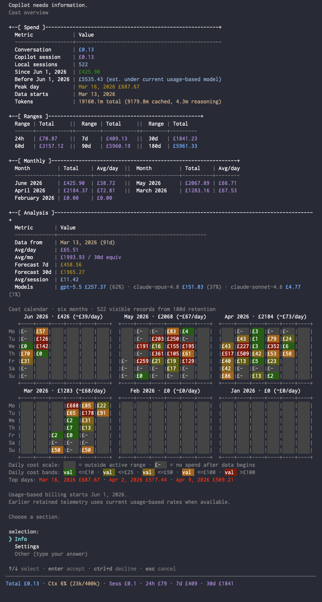

# copilot-cost usage

`copilot-cost` is a GitHub Copilot CLI extension that renders a short cost summary after assistant messages and/or in the statusline footer. It prefers live Copilot AI-credit usage data, then falls back to retained token/model metadata only when authoritative AIU totals are unavailable.

## Preview

After each assistant response:

```text
[21:00] +£0.03 in 15.4s · Next >= [£0.03 - £0.14] · Cache 96% read
```

In the footer/statusline:

```text
Total £1.24 · Ctx 48% (96k/200k) · Sess £1.4 · 24h £0 · 7d £2 · 30d £8
```

The after-message line shows the last assistant message cost and duration, next-message estimate, and cache read rate. The footer shows the best-known current conversation total, context-window usage, and a cumulative totals group: `Sess` for the current Copilot CLI session total alongside ledger-derived rolling 24h/7d/30d costs.

## What it shows

| Surface | Meaning |
| --- | --- |
| Last message cost and time | Observed cost and duration for the last assistant message. |
| Conversation total | Best-known current conversation total: local assistant/compaction usage stays pending until Copilot's official statusline counter catches up. |
| Copilot session total | Copilot's cumulative official running cost for the current Copilot CLI session, shown as `Sess` in the cumulative totals group. |
| Next-response estimate | Warm-cache to cold-cache cost range for the next response. |
| Cache health | Cache read percentage, plus cache write percentage when available. |
| Context usage | Current tokens and context limit. |
| Rolling totals | 24-hour, 7-day, and 30-day cumulative costs from the local session ledger, shown alongside `Sess`. |

`Sess` is the cumulative live official Copilot CLI session counter, shown in the same cumulative totals group as the 24h/7d/30d values. The same counter reconciles locally pending `Total` and keeps the current session ledger up to date because local events can miss tool and sub-agent work, but Copilot CLI sessions are still terminal instances rather than conversation or account boundaries. Rolling 24h/7d/30d totals come from local Copilot CLI session telemetry and are not account-wide Copilot billing totals; they do not include other Copilot surfaces such as VS Code. Usage-based billing started on 2026-06-01, so earlier pay-per-message totals are ignored and retained token telemetry is valued as a historical equivalent under the current usage-based model when a local post-June rate profile or built-in GitHub pricing fallback is available.

Copilot CLI also has a built-in `/usage` command that presents broader account/activity data, including last-180-days activity, message count, changes, AI Credits, and token totals with cached/reasoning breakdowns. That is the kind of official source needed for account-level cumulative metrics, but this project has not verified an extension API for reading the `/usage` data directly. The known account quota API exposes billing-period quota snapshots, not 24h/7d/30d historical spend, and is not used automatically by setup.

## Install

Make sure Copilot CLI is up to date:

```sh
copilot update
```

Make sure Node.js 18 or newer is installed and available as `node`. The first-run footer setup writes a `statusLine.command` that calls `node` directly.

Add this repository as a plugin marketplace, then install `copilot-cost`:

```sh
copilot plugin marketplace add RogueKernel/copilot-extensions
copilot plugin install copilot-cost@copilot-extensions
```

Open Copilot CLI with experimental extension support enabled:

```sh
copilot --experimental
```

`copilot --experimental` opens an interactive Copilot session and stays open, so do not chain another install command after it with `&&`. If you are already inside Copilot, make sure experimental mode is on with `/experimental on`.

Copilot CLI 1.0.62 and newer loads native extensions shipped by installed plugins. On first run, `copilot-cost` configures `statusLine.command` to call the plugin-bundled extension directly with `node`, enables `footer.showCustom`, and removes the old generated user shim if it was created by a previous setup version.

Restart Copilot CLI, start a new session, or run `/clear`. If the extension does not appear, run `/extensions`, choose **manage**, and enable `copilot-cost`.

## Update

```sh
copilot plugin marketplace update copilot-extensions
copilot plugin update copilot-cost
```

After updating, open a new Copilot CLI session or run `/clear` so the updated plugin-bundled extension is reloaded.

## Uninstall

Open `/cost`, choose **Settings**, then choose **Uninstall**. That restores any prior statusline/footer settings.

Afterward, remove the plugin package if you no longer want it installed:

```sh
copilot plugin uninstall copilot-cost
```

If you added this repository only for `copilot-cost`, you can also remove the marketplace:

```sh
copilot plugin marketplace remove copilot-extensions
```

Local checkout install instructions for maintainers live in [`development.md`](development.md).

## Configure

Use `/cost` for an interactive overview of recent local cost history. The top-level view shows current totals, 24h/7d/30d/60d/90d/180d cumulative totals, cost by calendar month for the current and previous four months, a six-month month-block calendar with blank pre-data days and dash-filled no-spend days after local data begins, usage-based billing cost since June 1, 2026, historical equivalent estimates for earlier retained telemetry, and run-rate analysis based on the available local data coverage. Choose **Info** for metric/source details or **Settings** to configure what the extension shows, where it appears, which unit to use, how summaries are formatted, export debug data, clear plugin data, or restore prior footer settings.



Direct commands:

```text
/cost both
/cost footer
/cost message
/cost off
/cost gbp
/cost usd
/cost credits
```

On first run, `copilot-cost` configures Copilot CLI's built-in Custom Footer through `statusLine.command` and enables `footer.showCustom`. If another statusline command already exists, it is replaced with `copilot-cost` and saved so `/cost` > **Settings** > **Uninstall** can restore it.

The Settings view also includes maintenance actions. **Export Session Data** writes `COPILOT_COST_DEBUG.jsonl` to the current working directory with one redacted JSONL record per discovered local Copilot CLI session: event-file metadata, event/type counts, token/cost/model summaries, and any matching ledger record. It excludes prompts, responses, transcript text, tool arguments, source code, and absolute local paths; event-file paths are normalized to session-state labels. **Clear Plugin Data** removes the `copilot-cost` plugin-data folder, including settings, session ledger history, runtime totals, export state, and managed statusline state. It does not remove the plugin package or Copilot settings.

Defaults:

| Setting | Default |
| --- | --- |
| Display | Both after-message and footer |
| Unit | GBP |
| After-message format | `[{time}] {message_group} · {next_group} · {cache_group}` |
| Footer format | `{total_group} · {context_group} · {windows_group}` |

## Persisted data

`copilot-cost` persists small JSON files so runtime accounting state survives extension reloads and Copilot CLI restarts. It stores cost/accounting state only; it does not persist prompts, responses, transcript text, file paths from your work, or source code.

| File | Scope | Why it exists |
| --- | --- | --- |
| `~/.copilot/plugin-data/copilot-extensions/copilot-cost/settings.json` | Global user | Saves display mode, unit, and custom format strings. |
| `~/.copilot/plugin-data/copilot-extensions/copilot-cost/session-ledger.json` | Global user | Single cost/state file. Stores per-session cost records for rolling 24h/7d/30d totals, the 180-day overview, and lean runtime display/reconciliation state. |
| `~/.copilot/plugin-data/copilot-extensions/copilot-cost/install-state.json` | Plugin installer | Stores the prior statusline/footer settings so the `/cost` uninstall flow can restore them. |
| `./COPILOT_COST_DEBUG.jsonl` | Current working directory, on demand | Redacted diagnostic export for debugging session discovery and cost extraction. Created only by **Export Session Data**. |

When Copilot provides `COPILOT_PLUGIN_DATA`, setup and runtime state use that directory instead of the fallback path above. When Copilot passes the shared `~/.copilot/session-state` root to the statusline command, `copilot-cost` combines it with the active `session_id` before deriving the plugin-data session key. That keeps parallel terminal sessions isolated, but it should not be interpreted as a user conversation boundary.

Example settings file:

```json
{
  "mode": "both",
  "unit": "gbp",
  "messageFormat": "[{time}] {message_group} · {next_group} · {cache_group}",
  "footerFormat": "{total_group} · {context_group} · {windows_group}"
}
```

Example session ledger file:

```json
{
  "version": 1,
  "lastSyncAt": 1781008000000,
  "sessions": {
    "00000000-0000-4000-8000-000000000000": {
      "id": "00000000-0000-4000-8000-000000000000",
      "state": "closed",
      "totalNanoAiu": 274586275000,
      "source": "shutdown",
      "firstSeenAt": 1781000000000,
      "lastSeenAt": 1781007900000,
      "lastUpdatedAt": 1781007900000,
      "closedAt": 1781007900000
    }
  },
  "runtime": {
    "workspace-38595a0d0908": {
      "totalUsd": 1.52,
      "sessionUsd": 1.40,
      "officialSegmentUsd": 1.40,
      "pendingUsd": 0.12,
      "contextTokens": 63000,
      "contextTokenLimit": 264000
    }
  }
}
```

## Format tokens

Group placeholders render complete labelled segments:

`{windows_group}` is the cumulative totals group: `Sess` plus rolling 24h/7d/30d totals.

| Placeholder | Renders like |
| --- | --- |
| `{message_group}` | `+£0.03 in 15.4s` |
| `{next_group}` | `Next >= [£0.03 - £0.14]` |
| `{cache_group}` | `Cache 96% read` |
| `{total_group}` | `Total £1.24` |
| `{context_group}` | `Ctx 48% (96k/200k)` |
| `{windows_group}` | `Sess £1.4 · 24h £0 · 7d £2 · 30d £8` |

Value placeholders render bare values for custom labels:

| Placeholder | Meaning |
| --- | --- |
| `{time}` | Finish time, such as `21:00`. |
| `{cost}` | Best-known current conversation total, such as `£1.24`. |
| `{sess_cost}` | Current cumulative Copilot CLI session total, such as `£1.4`. |
| `{msg_cost}` | Last assistant message cost, such as `+£0.03`. |
| `{msg_time}` | Last assistant message time, such as `15.4s`. |
| `{cached}` / `{uncached}` | Next-message minimum-cost estimate with warm-cache context vs stale-cache context, plus average recent uncached input/output work from the last 5 messages. |
| `{cost_24h}` / `{cost_7d}` / `{cost_30d}` | Rolling cumulative costs from the local session ledger. |
| `{ctx_used}` / `{ctx_total}` | Context token counts. |
| `{cache_read}` / `{cache_write}` | Cache read/write rates; `{cache_write}` is empty when unavailable. |

Use group placeholders for ready-made labelled output. Use value placeholders when you want your own labels, brackets, or separators. Unknown placeholders are left visible so typos are easy to spot. Leave a format empty to restore the default.
